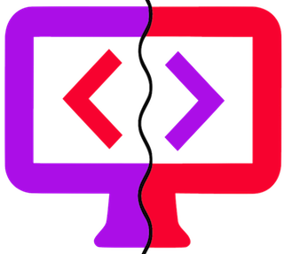

remote-code [](https://travis-ci.org/anoff/remote-code)
===

> live-reload for ssh connected devices 🐪 ⌨️️️️️

<p align="center">
  
</p>

_What is remote-code?_
`remote-code` is a developer tool that helps you to write code on your normal developer machine but actually run on a remote device (e.g. raspberry pi). It automagically syncs your local files with the remote, runs `npm install` on the device if you update your `package.json` and makes sure the remote process keeps running while you develop using nodemon.

_Why would I need that?_
You may need it depending on your project and how you want to develop; my need for a tool like this emerged from projects supposed to run on a raspberry pi that heavily relies on using pi specific hardware like bluetooth, IO ports etc.
The alternative to remote coding would be to develop on the pi directly. That means either replicating your dev setup onto the machine or working with less familiar tools.

# Install

Recommended to use as CLI

```
$ npm i -g remote-code
```

## supported platforms

`remote-code` relies heavily on other node modules to achieve the functionality, while they claim to support all major operating systems there currently is no test suite for this. Feel free to contribute 🐳

It has been tested for the following combinations of host/client

| host | client |
|------|--------|
| MacBook Pro | raspbian |

## prerequisites

At the moment your host needs to fulfill a few requirements for this to work:
* rsync installed
* yarn & nodemon globally available (need to implement setup routines)

_It is planned to ship `remote-code` with a **setup** routine that installs those dependencies on the remote_

# Usage

## CLI

```
$ remote-code help
  live-reload for ssh connected devices 🐪 ⌨️️️️️

  Usage
        $ remote-code <[user@]host>

  Options
        --port, -p              Custom port [22]
        --identity-file, -i      SSH keyfile
        --user, -u              SSH username
        --password, -P          SSH password (not supported)
        --source, -s            directory to synchronize (local) [CWD]
        --target, -t            remote location to sync to [~]

  Examples
        $ remote-code user@192.168.0.4
        $ remote-code -p 23 -i ~/.ssh/id_rsa --user admin 192.168.0.4
```


# License

MIT © [anoff](http://anoff.io)

## Credits

Kudos to the libraries I didn't have to worry about because someone else did:
* [chokidar](https://github.com/paulmillr/chokidar): watch files on local system
* [rsync](https://github.com/mattijs/node-rsync): copy code from local to remote
* [nodemon](https://github.com/remy/nodemon): keep node process on remote running
* [ssh2](https://github.com/mscdex/ssh2): start remote processes like `nodemon` and `npm/yarn install`
